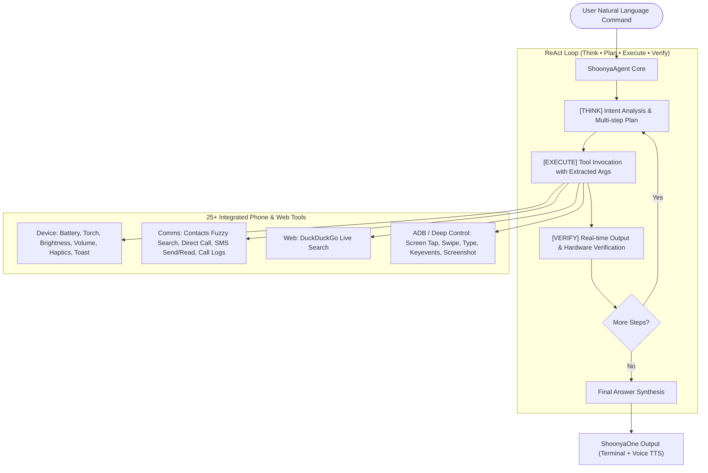

# 🚀 ShoonyaOne - Autonomous Personal AI Agent

<p align="center">
  <b>Created & Developed by <a href="https://github.com/vikashpawan626-cloud">Vikash Kumar</a></b><br>
  <i>An autonomous personal AI assistant specifically engineered for Android / Termux environments.</i>
</p>

<p align="center">
  <a href="https://github.com/vikashpawan626-cloud/ShoonyaOne/stargazers"></a>
  <a href="https://github.com/vikashpawan626-cloud/ShoonyaOne/network/members"></a>
  <a href="https://github.com/vikashpawan626-cloud/ShoonyaOne/issues"></a>
  <a href="https://github.com/vikashpawan626-cloud"></a>
</p>

---

ShoonyaOne ek autonomous personal AI assistant hai jo specifically **Android / Termux** environment ke liye banaya gaya hai (optimized for **Motorola Edge 40 Neo** on **Android 15**).

Yeh assistant user ke natural language (Hindi, Hinglish, English) me diye gaye multi-step commands ko samjhta hai, unka step-by-step execution plan banata hai, real hardware aur system tools ko run karta hai, aur output ko verify karke crisp voice & visual output deta hai.

---

## 🧠 Core Architecture: Think ➔ Plan ➔ Execute ➔ Verify Loop



---

## 🛠️ Integrated Capabilities (25+ Tools)

### 1. Device Hardware
- `get_battery_status`: Battery %, health, temperature, charging status
- `set_torch(state)`: Flashlight ON/OFF
- `set_brightness(level)`: Display brightness (0-255)
- `set_volume(stream, volume)`: Music, call, ring, alarm, notification volume control
- `get_volume_info`: Check current audio stream volumes
- `vibrate_phone(duration_ms)`: Haptic vibration feedback
- `show_toast(message)`: Screen par instant popup message
- `send_notification(title, content)`: Android status bar notification
- `read_notifications`: WhatsApp/SMS notifications read karna
- `get_clipboard` / `set_clipboard`: Clipboard read/write
- `get_wifi_info`: Connected WiFi details

### 2. Telephony & Communication
- `search_contacts(query)`: Fuzzy matching se contact search
- `make_phone_call(target)`: Contact name ya number par direct call
- `send_sms(target, message)`: Direct SMS bhejta hai
- `read_sms_inbox(limit)`: Latest SMS inbox check karna
- `get_call_logs(limit)`: Incoming/outgoing/missed call history

### 3. Web & Knowledge
- `search_web(query)`: Live DuckDuckGo web search aur smart summary

### 4. Deep Device Automation (Wireless ADB)
- `tap_screen(x, y)`: Screen par coordinates par click
- `swipe_screen(x1, y1, x2, y2)`: Gestures aur scrolling
- `type_text(text)`: Kisi bhi app me direct typing
- `press_key(key)`: HOME, BACK, RECENTS button press
- `take_screenshot(path)`: Real-time screen capture
- `open_app(package_or_url)`: Apps aur links launch karna

### 5. Voice
- `speak(text)`: Termux TTS ke zariye voice output
- `listen_speech()`: Mic ke zariye user ki aawaz sun kar text convert karna

---

## 🚀 How to Run

### 1. Interactive Terminal Mode
```bash
python3 main.py
```
*(Yahan natural language me baat karein, jaise: `battery check karo aur brightness 150 kardo`)*

### 2. Voice Input Mode
Terminal me `voice` type karein, ya direct chalayein:
```bash
python3 main.py --voice
```

### 3. One-Shot Command Execution
```bash
python3 main.py "Phone ki battery check karo aur toast message dikhao"
```

---

## 📱 Wireless ADB (Full Device Control Setup)

Motorola Edge 40 Neo (Android 15) par bina computer ke full device control ke liye:
1. **Developer Options** me jayein aur **Wireless debugging** ON karein.
2. **"Pair device with pairing code"** par tap karein.
3. Termux me command chalayein:
   ```bash
   adb pair localhost:<PAIR_PORT> <PAIR_CODE>
   ```
4. Connect karein:
   ```bash
   adb connect localhost:<CONNECT_PORT>
   ```
Ab ShoonyaOne screen par gestures, typing aur apps automation autonomous tareeqe se kar sakta hai!

---

## 👨‍💻 Creator & Lead Developer

**Vikash Kumar**
- **GitHub:** [@vikashpawan626-cloud](https://github.com/vikashpawan626-cloud)
- **Repository:** [ShoonyaOne on GitHub](https://github.com/vikashpawan626-cloud/ShoonyaOne)
- **Email:** [vikashpawan626@gmail.com](mailto:vikashpawan626@gmail.com)

> *ShoonyaOne is an open-source personal AI agent architected, designed, and developed by **Vikash Kumar**.*

---

## 📜 Citation & Reference

Agar aap ShoonyaOne ko kisi project, research, ya blog me refer karte hain, toh kripya is tarah cite karein:

```bibtex
@software{kumar2026shoonyaone,
  author = {Vikash Kumar},
  title = {ShoonyaOne: Autonomous Personal AI Agent for Android and Termux},
  year = {2026},
  publisher = {GitHub},
  journal = {GitHub repository},
  howpublished = {\url{https://github.com/vikashpawan626-cloud/ShoonyaOne}}
}
```

